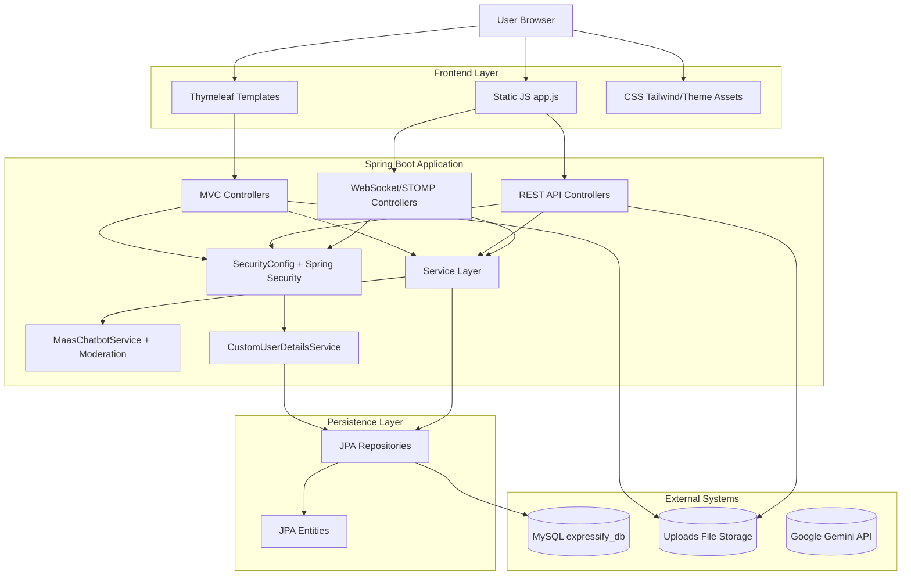

# Expressify Spring - Component Diagram

## Main Components Mapped

- Frontend: Thymeleaf pages, `static/js/app.js`, CSS/theme assets.
- Controllers: MVC pages (`HomeController`, `ProfileController`, `SettingsController`), REST APIs (`ApiController`, `FriendApiController`, `DmController`), and WebSocket controller (`ChatWebSocketController`).
- Services: `UserService`, `PostService`, `CommentService`, `LikeService`, `FriendService`, `NotificationService`, `ChatService`, `ReportService`, moderation/chatbot services.
- Security: `SecurityConfig` + `CustomUserDetailsService`.
- Data: JPA repositories/entities backed by MySQL.
- Integration points: file uploads and Gemini API.
