# Expressify

> A modern, full-stack social media web application built with Spring Boot 3.2, Java 17, Maven, Thymeleaf, Tailwind CSS, Spring Security, Spring Data JPA, MySQL, WebSockets, and an integrated AI Chatbot powered by Google Gemini.

---

## Key Features

- **Authentication & Security:** Secure session-based register and login powered by Spring Security and BCrypt password hashing.
- **Home Feed:** Interactive feed featuring posts with text, images, and video media support.
- **Post Creation:** Dedicated post creation interface supporting media uploads and post scheduling.
- **Social Engagement:** Real-time post likes, comment threads, comment likes, and profile post history.
- **User Profiles:** Customizable profiles displaying bio, avatar uploads, cover pictures, and user posts.
- **Explore Page:** Discover new community members and trending content across the platform.
- **Friends & Requests:** Send, accept, reject, or cancel friend requests and manage friend lists.
- **Notifications System:** Real-time and persistent notifications for likes, comments, and friend requests.
- **Settings & Themes:** Account management, password updates, and dynamic theme switching (**Light**, **Dark**, and **Unite** themes).
- **Real-Time Direct Messaging:** Live 1-on-1 private messaging using WebSockets and STOMP with SockJS fallback.
- **MAAS AI Chatbot:** Built-in conversational AI assistant ("MAAS AI") powered by Google Gemini API with an automatic Wikipedia fallback.
- **Admin Management Panel:** Administrative dashboard (`/admin`) for total metrics tracking, user management (view/ban/delete), post moderation, and content analysis.
- **Banned-Words Content Moderation:** Automatic content filtering service preventing inappropriate posts and text.

---

## How It Works

[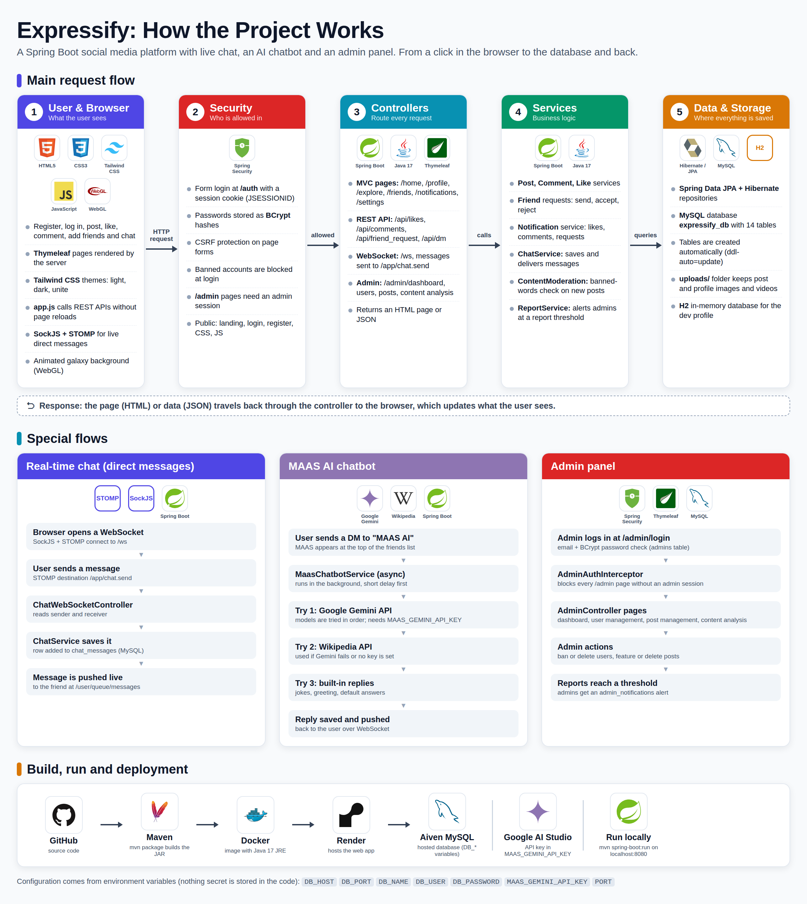](docs/screenshots/project-workflow.png)

*Click the workflow diagram above to open it in full size.*

Expressify processes client HTTP requests through Spring Security and Spring MVC controllers, executing business logic within decoupled service components. Data is persisted using Spring Data JPA and MySQL, while WebSockets (STOMP over SockJS) manage live direct messaging and asynchronous AI responses from MAAS AI (Google Gemini API with Wikipedia fallback). Administrative routes are secured via custom interceptors and dedicated admin tables.

---

## Screenshots

### Getting Started

| Landing Page | Register Page |
| :---: | :---: |
| [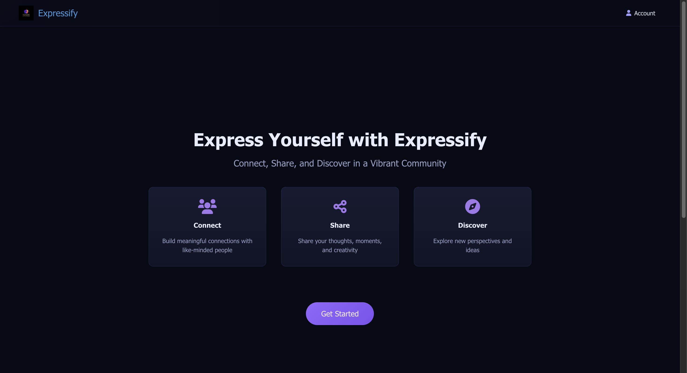](docs/screenshots/01-landing.png) | [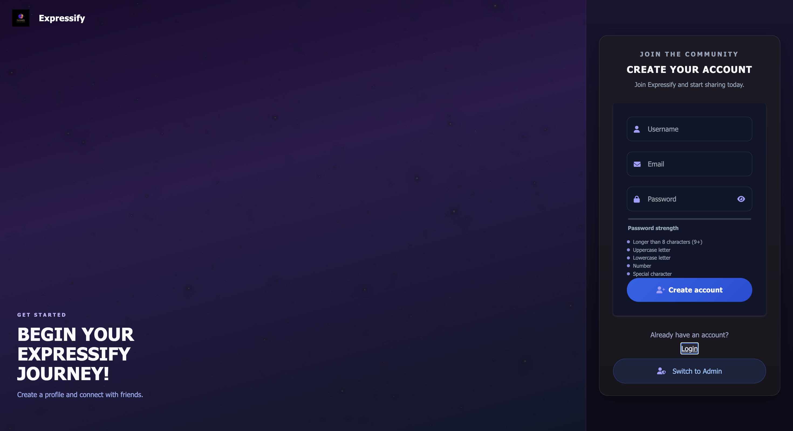](docs/screenshots/02-login-register.png) |
| **Landing Page** | **Register Page** |

| Login Page | |
| :---: | :---: |
| [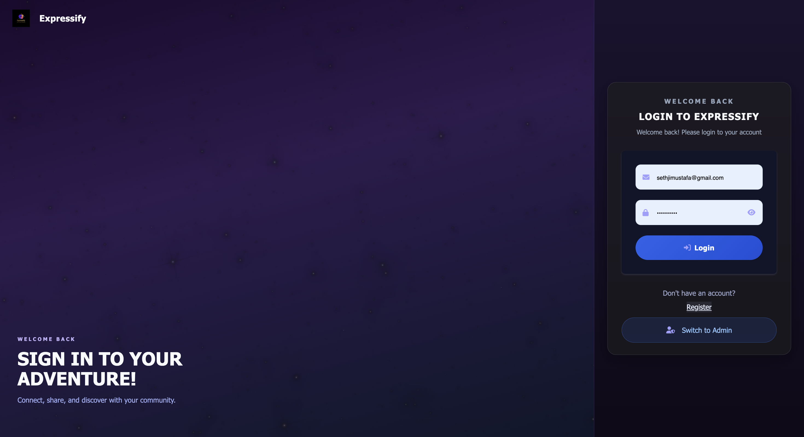](docs/screenshots/03-login.png) | |
| **Login Page** | |

### Main Application

| Home Feed | Explore Page |
| :---: | :---: |
| [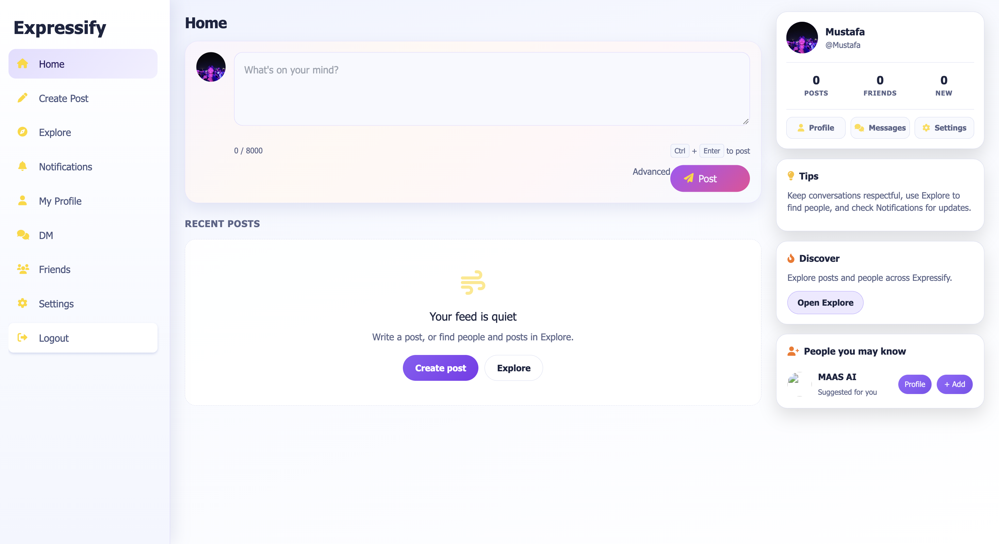](docs/screenshots/04-home-feed.png) | [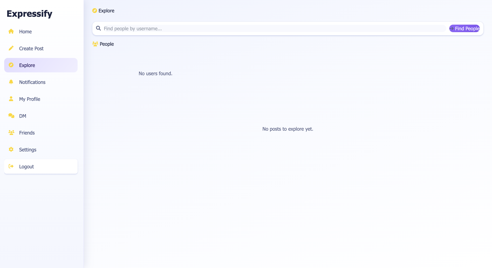](docs/screenshots/05-explore.png) |
| **Home Feed** | **Explore Page** |

| Real-Time Direct Messages | Settings |
| :---: | :---: |
| [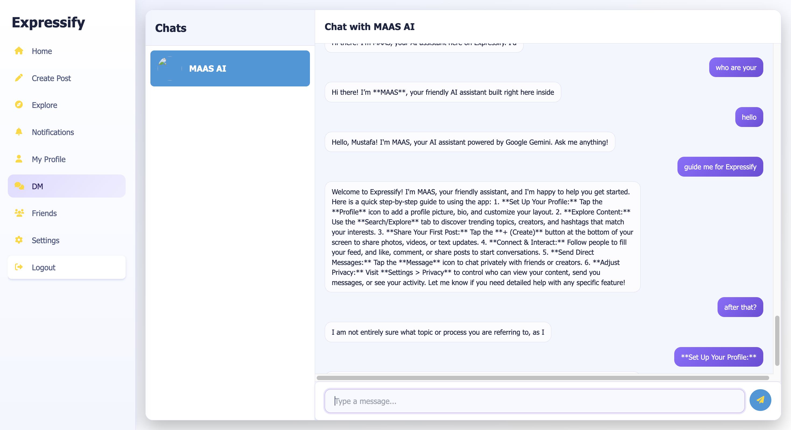](docs/screenshots/06-dm-chat.png) | [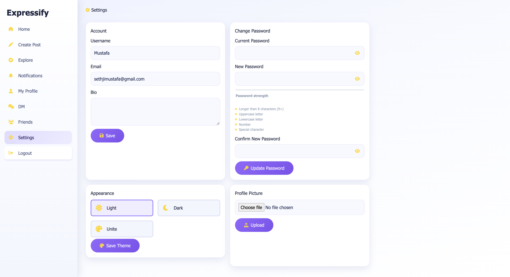](docs/screenshots/07-setting-profile.png) |
| **Real-time Direct Messages & MAAS AI Chat** | **Settings & Theme Customization** |

| Create Post | User Profile |
| :---: | :---: |
| [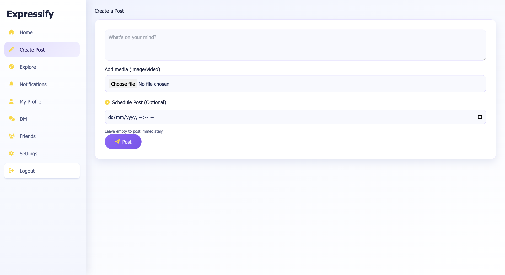](docs/screenshots/08-create-post.png) | [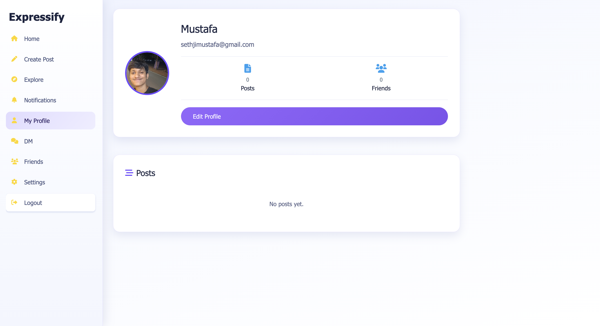](docs/screenshots/09-profile.png) |
| **Create Post** | **User Profile** |

| Notifications | Friends |
| :---: | :---: |
| [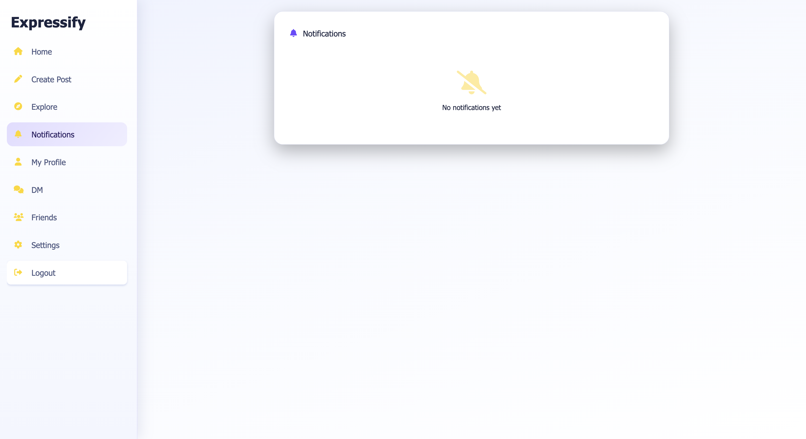](docs/screenshots/10-notification.png) | [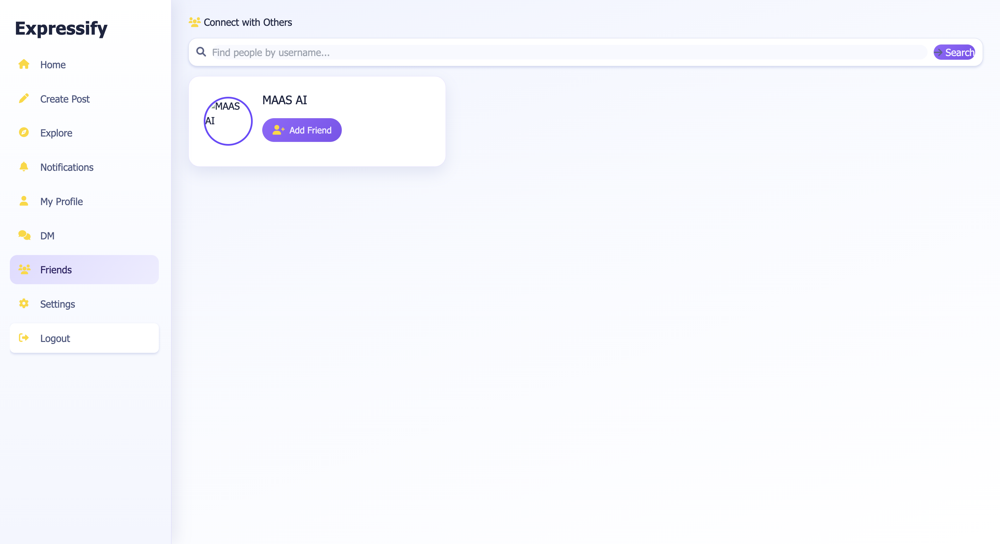](docs/screenshots/11-friends.png) |
| **Notifications** | **Friends & Friend Requests** |

### Admin Panel

| Admin Dashboard | Admin User Management |
| :---: | :---: |
| [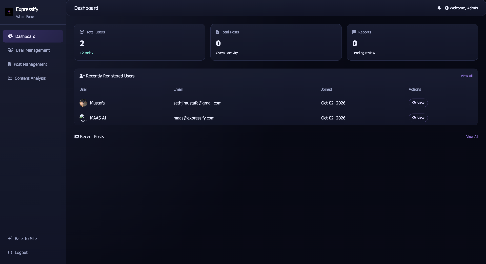](docs/screenshots/12-admin-dashboard.png) | [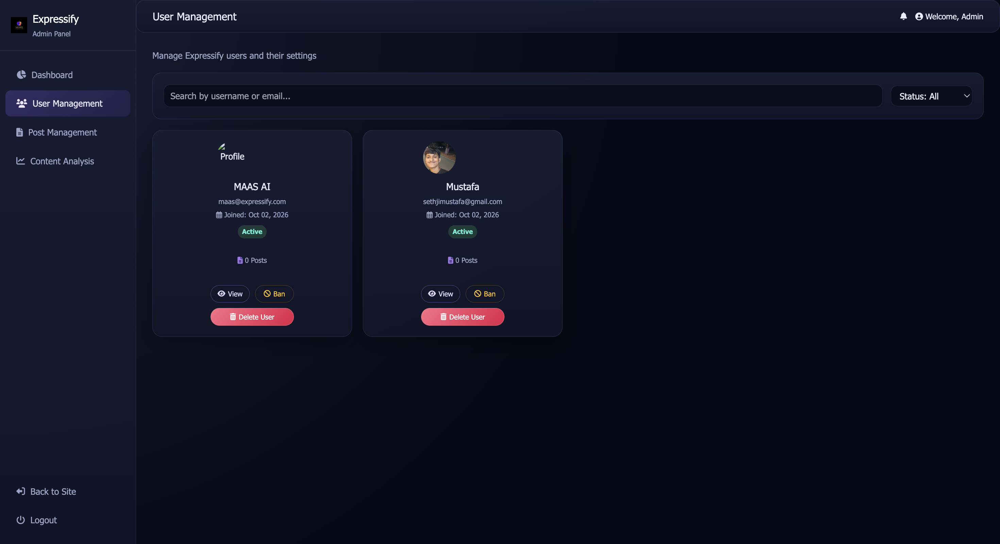](docs/screenshots/13-admin-user-management.png) |
| **Admin Dashboard** | **Admin: User Management** |

| Admin Content Analysis | |
| :---: | :---: |
| [](docs/screenshots/14-admin-content%20analysis.png) | |
| **Admin: Content Analysis** | |

---

## Database Schema

[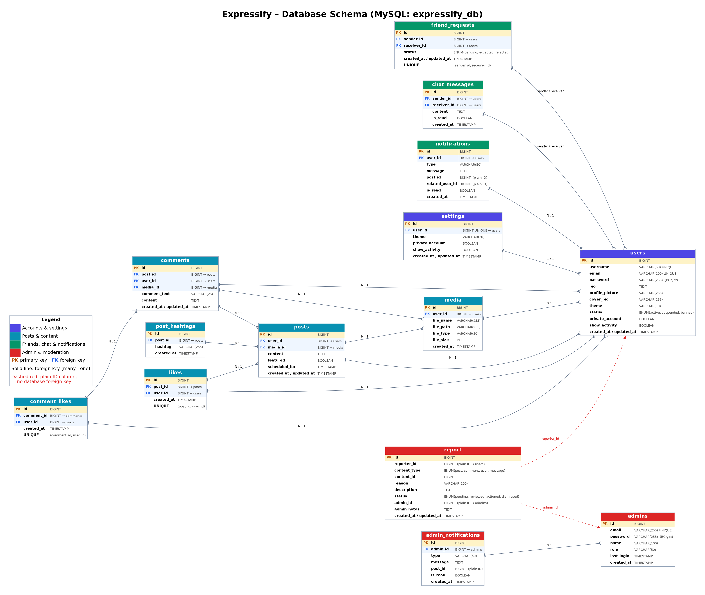](docs/screenshots/database-schema.png)

Expressify relies on a 14-table MySQL relational schema managed via Spring Data JPA:
- `users`: Core account information, BCrypt password hashes, and active status.
- `settings`: User preferences, privacy options, and UI theme selection (light, dark, unite).
- `posts`: User post content, featured status, and scheduled timestamps.
- `media`: File metadata and storage paths for post and profile uploads.
- `comments` & `comment_likes`: Post comments and individual comment likes.
- `likes`: Post likes mapping users to posts.
- `post_hashtags`: Hashtag mappings associated with posts.
- `friend_requests`: Sender/receiver states (`pending`, `accepted`, `rejected`).
- `chat_messages`: WebSocket direct messages between users and MAAS AI.
- `notifications`: User activity notifications.
- `admins` & `admin_notifications`: Separate admin panel accounts and platform security alerts.
- `report`: User-flagged content reports for administrative review.

---

## Tech Stack

| Category | Technologies |
| :--- | :--- |
| **Backend Framework** | Spring Boot 3.2, Java 17, Spring Security, Spring Data JPA, Spring WebSocket |
| **Frontend Templates** | Thymeleaf, HTML5, JavaScript (ES6+), SockJS, STOMP.js |
| **Styling & UI** | Vanilla CSS, Tailwind CSS (pre-compiled into `static/css/tailwind.css`), WebGL Galaxy background |
| **Database** | MySQL 8 (Production/Local), H2 In-Memory Database (Development Profile) |
| **Real-Time Communication** | WebSocket with STOMP protocol |
| **AI & External Services** | Google Gemini API (`gemini-3.6-flash`, `gemini-3.5-flash`, `gemini-3.1-flash-lite`), Wikipedia REST API fallback |
| **Build & Containerization** | Apache Maven 3.6+, Docker, Render deployment support, Aiven MySQL compatibility |

---

## Prerequisites

Ensure you have the following installed on your system:
- **Java 17 Development Kit (JDK 17+)**
- **Apache Maven 3.6+**
- **MySQL Server 8.0+**
- **Internet Access** (required for fetching CDN scripts such as SockJS, STOMP, and Google Fonts)

> **Note on Node.js:** Node.js is **NOT required** to run or deploy Expressify because CSS assets are prebuilt in `src/main/resources/static/css/tailwind.css`. `npm run tailwind:build` is only needed if you wish to modify utility classes in `tailwind-input.css`.

### Installation Commands

#### macOS (Homebrew)
```bash
brew install --cask temurin@17
brew install maven mysql
brew services start mysql
```

#### Windows
- Download JDK 17 installer from [Eclipse Adoptium (Temurin)](https://adoptium.net/).
- Install Maven and MySQL Server 8 via official installers or standard environment setups.

#### Linux (Ubuntu/Debian)
```bash
sudo apt update
sudo apt install openjdk-17-jdk maven mysql-server
sudo systemctl start mysql
```

---

## Run Locally (with MySQL)

1. **Create the MySQL Database:**
   ```bash
   mysql -u root -e "CREATE DATABASE expressify_db;"
   ```
   *(Note: Add `-p` if your local MySQL root user requires a password, e.g., `mysql -u root -p -e "CREATE DATABASE expressify_db;"`)*

2. **Set Environment Variables in Terminal:**
   Set required environment variables in your current terminal session (do not hardcode secrets into source files):
   ```bash
   # Set your MySQL root password (skip or leave empty if root has no password)
   export DB_PASSWORD=your_mysql_password

   # (Optional) Set your Google Gemini API key for MAAS AI
   export MAAS_GEMINI_API_KEY=your_gemini_api_key
   ```

3. **Build and Run the Application:**
   ```bash
   mvn spring-boot:run
   ```

4. **Access the Web Application:**
   Once the terminal displays `Started ExpressifyApplication in ... seconds`, open your browser and navigate to:
   - Main Web App: **`http://localhost:8080`**
   - Admin Panel: **`http://localhost:8080/admin/login`**

5. **Stop the Application:**
   Press `Ctrl + C` in your terminal window.

---

## Run Without MySQL (Development Profile)

If you prefer to run Expressify instantly without setting up MySQL, use the built-in `dev` profile with an H2 in-memory database:

```bash
mvn spring-boot:run -Dspring-boot.run.profiles=dev
```

> **Note:** When using the `dev` profile, data is stored in memory and will be reset when the application stops. The H2 web console can be accessed at `http://localhost:8080/h2-console` (JDBC URL: `jdbc:h2:mem:expressify`, Username: `sa`, Password: empty).

---

## Running Again Later

When starting the project in a new terminal session later:
1. Navigate into the project folder:
   ```bash
   cd /path/to/Expressify
   ```
2. Re-export your environment variables if needed (or store them in `~/.zshrc` / `~/.bashrc`):
   ```bash
   export DB_PASSWORD=your_mysql_password
   export MAAS_GEMINI_API_KEY=your_gemini_api_key
   ```
3. Run the application:
   ```bash
   mvn spring-boot:run
   ```

---

## How to Get a Google Gemini API Key (Google AI Studio)

1. Navigate to **[Google AI Studio - API Keys](https://aistudio.google.com/apikey)** and sign in with a personal Google account (*Note: school or corporate Google Workspace accounts may restrict API key creation*).
2. Accept the terms of service if prompted.
3. Click **"Create API key"**.
4. Leave the default key name or specify a custom name, and select **"Default Gemini Project"** (or create a new project).
5. Click **"Create key"** and copy the generated API key string.
6. If an *"Upgrade to unlock more"* popup appears, simply close it. The free tier quota is sufficient for development, and no billing details are required.
7. In your terminal session, export the key before running the server:
   ```bash
   export MAAS_GEMINI_API_KEY=AIzaSy...
   ```
8. **Verification:**
   - Log into Expressify, navigate to **DM**, and select **MAAS AI**.
   - Send a message (e.g., *"What is Spring Boot?"*).
   - Check terminal logs for `MAAS: Gemini (gemini-3.6-flash) responded successfully.`
   - If the chatbot returns brief 2-sentence Wikipedia summaries, your API key is missing or invalid.
9. **Security Warning:** Never commit your API key to Git or share terminal logs containing it. If your key is accidentally exposed, delete it immediately in Google AI Studio and generate a new key.

---

## Environment Variables

| Variable Name | Required? | Default Value | Purpose |
| :--- | :---: | :--- | :--- |
| `PORT` | Optional | `8080` | Web server listening port (automatically populated on platforms like Render) |
| `DB_HOST` | Optional | `localhost` | MySQL host address |
| `DB_PORT` | Optional | `3306` | MySQL server port |
| `DB_NAME` | Optional | `expressify_db` | MySQL database name |
| `DB_USER` | Optional | `root` | MySQL user account |
| `DB_PASSWORD` | Optional | *(empty)* | MySQL user password |
| `MAAS_GEMINI_API_KEY` | Optional | *(empty)* | Google Gemini API key for MAAS AI chatbot |

---

## Default Accounts & Credentials

- **Admin Account:**
  - Login URL: `http://localhost:8080/admin/login`
  - Email: `abdulroot@gmail.com`
  - Password: `1234`
  - > ⚠️ **Security Warning:** These are local demo credentials initialized in `AdminDataInitializer.java`. Change this password or disable initial seed code before any public or production deployment.

- **MAAS AI Bot User:**
  - Email: `maas@expressify.com`
  - Automatically initialized as the system AI user for WebSocket direct messaging.

---

## Troubleshooting

- **`Access denied for user 'root'@'localhost'`:**
  Ensure you exported your correct MySQL password (`export DB_PASSWORD=your_password`) before running `mvn spring-boot:run`.
- **`Unknown database 'expressify_db'`:**
  Run `mysql -u root -e "CREATE DATABASE expressify_db;"` to create the MySQL database prior to starting the application.
- **`Port 8080 is already in use`:**
  Change the port using the `PORT` environment variable:
  ```bash
  export PORT=8081
  mvn spring-boot:run
  ```
- **MAAS AI chatbot falls back to Wikipedia answers:**
  Verify that `MAAS_GEMINI_API_KEY` is exported correctly in your active terminal, and verify model compatibility in `MaasChatbotService.java`.
- **Uploaded profile pictures or post images fail to load:**
  Ensure that the local `uploads/` directory exists with proper write permissions on your system.

---

## Project Structure & Deployment

```
Expressify/
├── Dockerfile                           # Production Docker image configuration
├── pom.xml                              # Maven build dependencies
├── README.md                            # Main project documentation
├── FOLDER_STRUCTURE.md                  # Comprehensive folder hierarchy guide
├── COMPONENT_DIAGRAM.md                 # System component & architecture breakdown
├── docs/screenshots/                    # Documentation screenshots & workflow diagrams
├── uploads/                             # Local file upload directory (ignored by git)
│   ├── posts/                           # Uploaded post images & media
│   └── profiles/                        # Uploaded user profile pictures
└── src/
    └── main/
        ├── java/com/expressify/
        │   ├── config/                  # Security, WebMvc, WebSocket & Admin Initializer
        │   ├── controller/              # MVC, REST, Admin & WebSocket controllers
        │   ├── dto/                     # Data Transfer Objects
        │   ├── entity/                  # JPA Database Entities
        │   ├── interceptor/             # Admin authentication interceptor
        │   ├── repository/              # Spring Data JPA Repositories
        │   ├── service/                 # Core business logic, Chat & Gemini AI services
        │   └── util/                    # Password policy utilities
        └── resources/
            ├── application.properties   # Production/Local configuration
            ├── application-dev.properties   # H2 in-memory dev configuration
            ├── moderation/              # Banned-words filter list
            ├── static/                  # Prebuilt Tailwind CSS, WebGL background & JS
            └── templates/               # Thymeleaf HTML views (incl. Admin panel)
```

### Docker Deployment

To build and run Expressify using Docker:

```bash
docker build -t expressify .
docker run -p 8080:8080 -e DB_HOST=your_db_host -e DB_USER=your_db_user -e DB_PASSWORD=your_db_pass expressify
```

When deploying to hosting platforms like **Render**, attach your MySQL database credentials (`DB_HOST`, `DB_PORT`, `DB_NAME`, `DB_USER`, `DB_PASSWORD`) and `MAAS_GEMINI_API_KEY` in the platform's Environment Variables panel.

---

## Credits

This project was originally created as a social media web application and enhanced with Spring Boot 3.2, WebSockets, dynamic themes, admin tools, and Google Gemini AI integration.

- **Original Author:** *(TODO: Add original author name/link if applicable)*
- **Maintainers & Contributors:** Expressify Team
# Expressify
